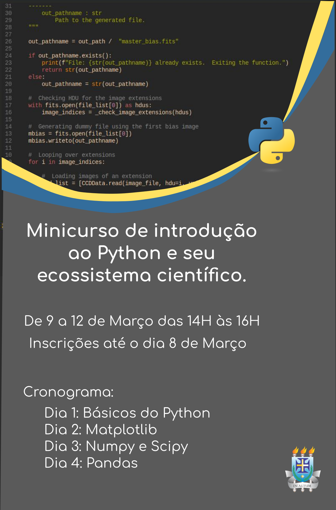

# minicurso-python-para-ciencia

Este é o material do curso ministrado em Março de 2021 na UESC, onde fizemos um
tour geral do Python e os pacotes científicos mais importantes.

OBS: O planejamento inicial não pôde ser seguido e o material de pandas ficou para o dia 5.

